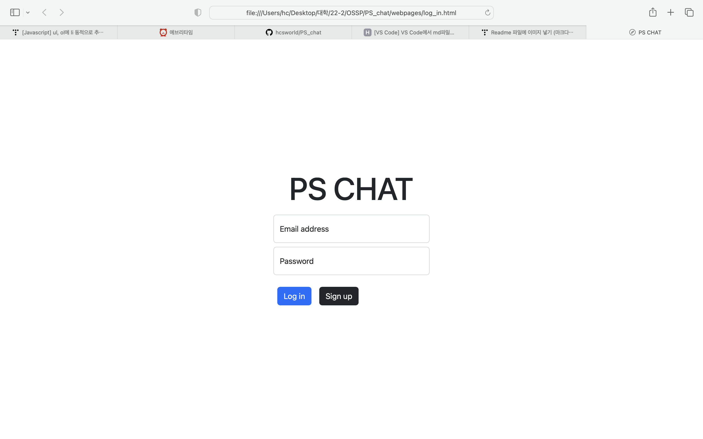
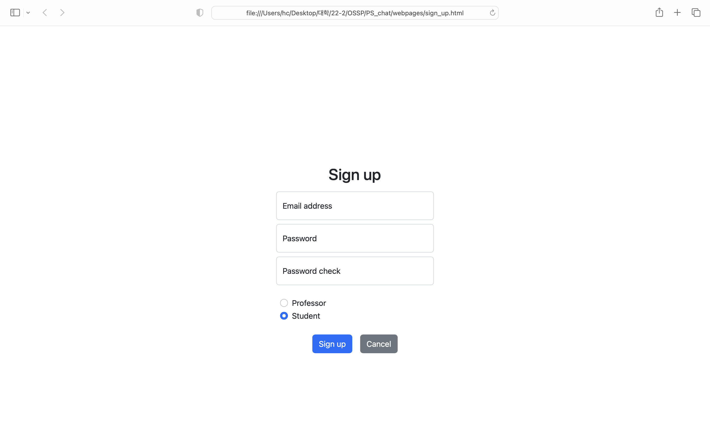
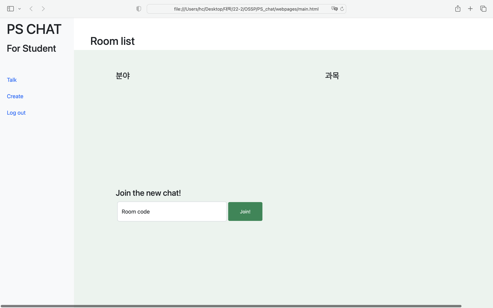
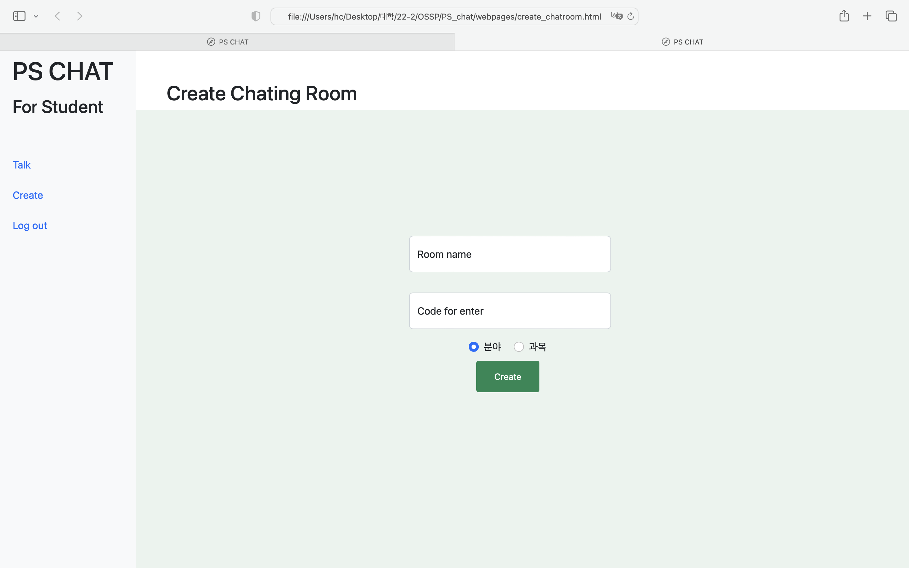
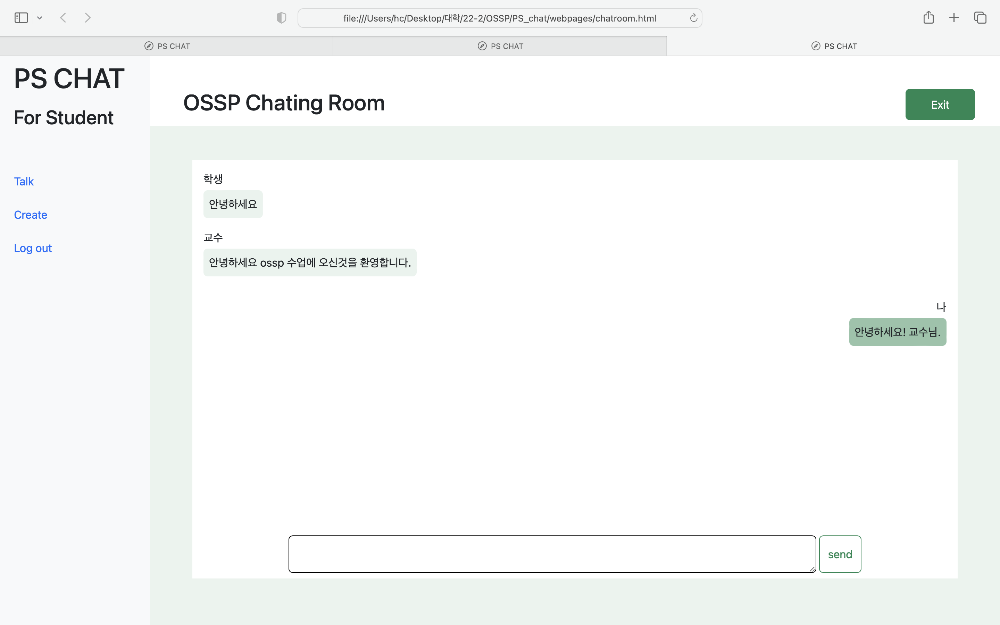

# PS Chat

## 페이지 소개
- **PS Chat**은 교수와 학생의 원할한 소통을 위해 만들어진 웹페이지 입니다. 익명으로 메세지를 전달함으로서 교수님께 직접 메세지를 보내기 어려워 하는 학생들에게 도움을 줄 것 입니다.
- 교수님이 분야 혹은 과목별로 채팅방을 개설할 수 있고 학생들은 맞는 코드를 입력하여 채팅방에 입장할 수 있습니다.
익명성이 보장되기에 학생들은 자유롭게 교수님께 하고싶은 말을 하면 됩니다.

## Implementating step
- VCS(Version control system)
    - branch
        - main : 웹페이지 프로트엔드 개발을 위한 branch
        - server : server 작업을 위한 branch
        - chatroom : 채팅방 페이지의 js등을 코딩하기 위한 branch
    - merge vs rebase : 기존의 branch를 보존할 수 있는 merge를 통해 두 명의 작업을 합쳤음.
    - git hub repository : 신현창의 github으로 remote repository를 만들었고 이상준이 collaborator로 참여.
- HTML
    - Bootstrap toolkits을 사용하여 design.
    - 전체적인 색감을 초록색으로 하여 성균관대의 상징색을 의미했음.
    - css를 이용하여 요소들의 크기 위치들을 조절함.

- Java Script
    - Server and client model을 node.js로 구현
    - 이를 위해 socket.io와 Express.js를 이용
    - Bootstrap의 JS를 이용하여 기능을 구현하기도 했음. 

## Links to Resource
- [Express.js](https://expressjs.com/ko/)
- [Socket.io](https://socket.io)
- [Bootstrap](https://getbootstrap.kr)

## Screenshot & how to use
- 로그인 페이지

아이디와 패스워드를 입력하여 접속한다. 만약 회원가입이 되어 있지 않으면 **Sign up** 버튼을 입력하여 가입 페이지로 넘어간다.

- 가입 페이지

아이디 패스워드를 입력하여 접속한다. 교수와 학생 라디오 버튼을 이용하여 교수인지 학생인지 구분하여 회원가입한다.

- 시작 페이지

원하는 채팅방에 입장할 수 있다. 만약 새로운 채팅방에 입장하고 싶으면 아래 label에 입장 코드를 입력하여 입장한다.

- 채팅방 개설 페이지
 
채팅방을 만든다. 채팅방 이름, 입장코드 그리고 분야/과목중 어떤 카테고리로 채팅방을 만들건지 정한다.

- 채팅방 페이지
 
채팅을 진행한다. 혹 채팅방에서 나가고 싶으면 위의 **Exit** 버튼을 클릭하여 나간다.

## installation & start
    npm install PS_chat
    cd PS_chat
    node app.js <-- server 시작

    //다음으로 원하는 브라우저 실행 후 주소창에 localhost:8000/log_in 입력 후 접속

## Releases
- **version 1.0.0**
- Next version is up to you
    
## How to contribute
- Come to our [repo](https://github.com/hcsworld/PS_chat)
- give us issue
- mail me if you want to be collaborator
hcshin9999@gamil.com

## License

MIT license

## Code of Conduct

- Safe work environment
- Mutual respect
- Empathy and kindness
- Contstructive feedback
- No trolling, insulting, harassment, etc.

## Youtube link

우수 프로젝트 시상 프로그램에 지원합니다.